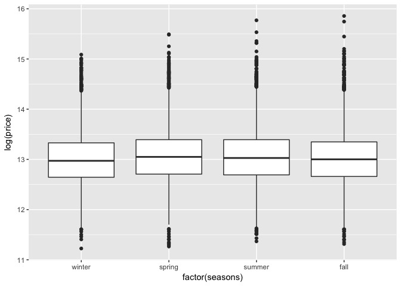
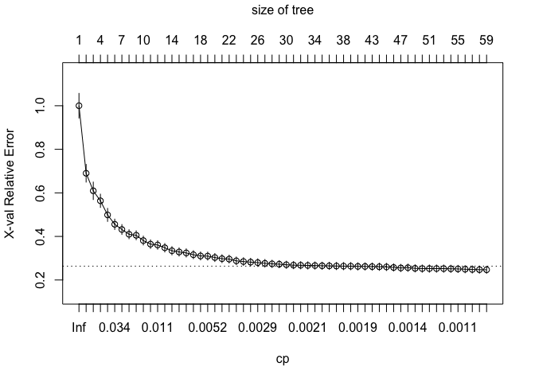

-   [<span style="color:blue">*Introduction*</span>](#introduction)
-   [<span style="color:blue">*Exploring the Data Set*</span>](#exploring-the-data-set)
    -   [<span style="color:green">\* Dealing with the variable: `date`\*</span>](#dealing-with-the-variable-date)
    -   [<span style="color:blue">\* Visualizing the data\*</span>](#visualizing-the-data)
    -   [<span style="color:blue">*Preparing the Data Set*</span>](#preparing-the-data-set)
-   [<span style="color:blue">*Fitting models using `lm` and `rpart`*</span>](#fitting-models-using-lm-and-rpart)
    -   [<span style="color:red">*OLSR Linear (lm) Model:*</span>](#olsr-linear-lm-model)
    -   [<span style="color:red">*Comparison of the `lm` models:*</span>](#comparison-of-the-lm-models)
    -   [<span style="color:green">\* CART (rpart) Model:\*</span>](#cart-rpart-model)
-   [<span style="color:blue">*Conclusion*</span>](#conclusion)

<span style="color:blue">*Introduction*</span>
----------------------------------------------

In this work, our aim is to do regression analysis using an OLSR linear (lm) model and a CART (rpart) model on the dataset `kc_house_data`. The dataset is obtained from Kaggle.

The dataset consists of data of houses sold between May 2014 to May 2015. Our `lm` and `rpart` models will predict the sales of houses in King County with an accuracy of at least 70-78%.

<span style="color:blue">*Exploring the Data Set*</span>
--------------------------------------------------------

First let’s read the data `kc_house_data` and explore the data.

``` r
kc_house_data<-read.csv('kc_house_data.csv')
dim(kc_house_data)
```

    ## [1] 21613    21

``` r
names(kc_house_data)
```

    ##  [1] "id"            "date"          "price"         "bedrooms"     
    ##  [5] "bathrooms"     "sqft_living"   "sqft_lot"      "floors"       
    ##  [9] "waterfront"    "view"          "condition"     "grade"        
    ## [13] "sqft_above"    "sqft_basement" "yr_built"      "yr_renovated" 
    ## [17] "zipcode"       "lat"           "long"          "sqft_living15"
    ## [21] "sqft_lot15"

In this data set, we have 21,613 observations and 21 variables. In this problem, our response varibale is `price`. The explanatory variables are the rest of the variables. Now let’s classify the variables.

``` r
library(dplyr)
```

    ## 
    ## Attaching package: 'dplyr'

    ## The following objects are masked from 'package:stats':
    ## 
    ##     filter, lag

    ## The following objects are masked from 'package:base':
    ## 
    ##     intersect, setdiff, setequal, union

``` r
library(ggplot2)
glimpse(kc_house_data)
```

    ## Observations: 21,613
    ## Variables: 21
    ## $ id            <dbl> 7129300520, 6414100192, 5631500400, 2487200875, ...
    ## $ date          <fct> 20141013T000000, 20141209T000000, 20150225T00000...
    ## $ price         <dbl> 221900, 538000, 180000, 604000, 510000, 1225000,...
    ## $ bedrooms      <int> 3, 3, 2, 4, 3, 4, 3, 3, 3, 3, 3, 2, 3, 3, 5, 4, ...
    ## $ bathrooms     <dbl> 1.00, 2.25, 1.00, 3.00, 2.00, 4.50, 2.25, 1.50, ...
    ## $ sqft_living   <int> 1180, 2570, 770, 1960, 1680, 5420, 1715, 1060, 1...
    ## $ sqft_lot      <int> 5650, 7242, 10000, 5000, 8080, 101930, 6819, 971...
    ## $ floors        <dbl> 1.0, 2.0, 1.0, 1.0, 1.0, 1.0, 2.0, 1.0, 1.0, 2.0...
    ## $ waterfront    <int> 0, 0, 0, 0, 0, 0, 0, 0, 0, 0, 0, 0, 0, 0, 0, 0, ...
    ## $ view          <int> 0, 0, 0, 0, 0, 0, 0, 0, 0, 0, 0, 0, 0, 0, 0, 3, ...
    ## $ condition     <int> 3, 3, 3, 5, 3, 3, 3, 3, 3, 3, 3, 4, 4, 4, 3, 3, ...
    ## $ grade         <int> 7, 7, 6, 7, 8, 11, 7, 7, 7, 7, 8, 7, 7, 7, 7, 9,...
    ## $ sqft_above    <int> 1180, 2170, 770, 1050, 1680, 3890, 1715, 1060, 1...
    ## $ sqft_basement <int> 0, 400, 0, 910, 0, 1530, 0, 0, 730, 0, 1700, 300...
    ## $ yr_built      <int> 1955, 1951, 1933, 1965, 1987, 2001, 1995, 1963, ...
    ## $ yr_renovated  <int> 0, 1991, 0, 0, 0, 0, 0, 0, 0, 0, 0, 0, 0, 0, 0, ...
    ## $ zipcode       <int> 98178, 98125, 98028, 98136, 98074, 98053, 98003,...
    ## $ lat           <dbl> 47.5112, 47.7210, 47.7379, 47.5208, 47.6168, 47....
    ## $ long          <dbl> -122.257, -122.319, -122.233, -122.393, -122.045...
    ## $ sqft_living15 <int> 1340, 1690, 2720, 1360, 1800, 4760, 2238, 1650, ...
    ## $ sqft_lot15    <int> 5650, 7639, 8062, 5000, 7503, 101930, 6819, 9711...

By looking at the data, we can tell that we have one factor variable: `date` and the other variables are numerical.

### <span style="color:green">\* Dealing with the variable: `date`\*</span>

We need to work on the variable `date` since it is not in a format we want it to be. We install the package `lubridate` for that purpose. We would like to categorize the date data into four classes: `winter`, `spring`, `summer` and `fall`. The following R-code does what we want.

``` r
library("lubridate")
```

    ## 
    ## Attaching package: 'lubridate'

    ## The following object is masked from 'package:base':
    ## 
    ##     date

``` r
month_sold<-month(lubridate::parse_date_time(kc_house_data$date,"ymdHMS"))
kc_house_data$seasons<- 
  cut((month_sold)%%12, breaks = c(-0.1,2.1, 5.1, 8.1, 11.1),
      labels = c("winter", "spring", "summer", "fall"),
      include.lowest = TRUE)
```

It makes sense to drop the variable `date` since we added a new variable `seasons`. We will also drop the variable `id` since we believe that it has no effect on `price`.

``` r
kc_house_data<-kc_house_data%>%
  select(-c(id,date))
```

    ## Warning: `lang()` is deprecated as of rlang 0.2.0.
    ## Please use `call2()` instead.
    ## This warning is displayed once per session.

    ## Warning: `new_overscope()` is deprecated as of rlang 0.2.0.
    ## Please use `new_data_mask()` instead.
    ## This warning is displayed once per session.

    ## Warning: `overscope_eval_next()` is deprecated as of rlang 0.2.0.
    ## Please use `eval_tidy()` with a data mask instead.
    ## This warning is displayed once per session.

``` r
glimpse(kc_house_data)
```

    ## Observations: 21,613
    ## Variables: 20
    ## $ price         <dbl> 221900, 538000, 180000, 604000, 510000, 1225000,...
    ## $ bedrooms      <int> 3, 3, 2, 4, 3, 4, 3, 3, 3, 3, 3, 2, 3, 3, 5, 4, ...
    ## $ bathrooms     <dbl> 1.00, 2.25, 1.00, 3.00, 2.00, 4.50, 2.25, 1.50, ...
    ## $ sqft_living   <int> 1180, 2570, 770, 1960, 1680, 5420, 1715, 1060, 1...
    ## $ sqft_lot      <int> 5650, 7242, 10000, 5000, 8080, 101930, 6819, 971...
    ## $ floors        <dbl> 1.0, 2.0, 1.0, 1.0, 1.0, 1.0, 2.0, 1.0, 1.0, 2.0...
    ## $ waterfront    <int> 0, 0, 0, 0, 0, 0, 0, 0, 0, 0, 0, 0, 0, 0, 0, 0, ...
    ## $ view          <int> 0, 0, 0, 0, 0, 0, 0, 0, 0, 0, 0, 0, 0, 0, 0, 3, ...
    ## $ condition     <int> 3, 3, 3, 5, 3, 3, 3, 3, 3, 3, 3, 4, 4, 4, 3, 3, ...
    ## $ grade         <int> 7, 7, 6, 7, 8, 11, 7, 7, 7, 7, 8, 7, 7, 7, 7, 9,...
    ## $ sqft_above    <int> 1180, 2170, 770, 1050, 1680, 3890, 1715, 1060, 1...
    ## $ sqft_basement <int> 0, 400, 0, 910, 0, 1530, 0, 0, 730, 0, 1700, 300...
    ## $ yr_built      <int> 1955, 1951, 1933, 1965, 1987, 2001, 1995, 1963, ...
    ## $ yr_renovated  <int> 0, 1991, 0, 0, 0, 0, 0, 0, 0, 0, 0, 0, 0, 0, 0, ...
    ## $ zipcode       <int> 98178, 98125, 98028, 98136, 98074, 98053, 98003,...
    ## $ lat           <dbl> 47.5112, 47.7210, 47.7379, 47.5208, 47.6168, 47....
    ## $ long          <dbl> -122.257, -122.319, -122.233, -122.393, -122.045...
    ## $ sqft_living15 <int> 1340, 1690, 2720, 1360, 1800, 4760, 2238, 1650, ...
    ## $ sqft_lot15    <int> 5650, 7639, 8062, 5000, 7503, 101930, 6819, 9711...
    ## $ seasons       <fct> fall, winter, winter, winter, winter, spring, su...

### <span style="color:blue">\* Visualizing the data\*</span>

In this section, we are going to pick some random variables and visually observe if they have some effects on the variable `price`. Note that we will take the "log" of `price` to make the boxplots look less skewed.

``` r
ggplot(data = kc_house_data, aes(x = factor(seasons), y = log(price))) +
geom_boxplot()
```



The boxplot `log(price)` vs `seasons` shows us `seasons` does not play a significant role in predicting `price` since the statistics of each category seem close.

Now let's see if `grade` has some effect on `price`.

``` r
ggplot(data = kc_house_data, aes(x = factor(grade), y = log(price))) +
geom_boxplot()
```


The boxplot shows us the variable `grade` has a significant effect on the `price` variable since the statistics of each class highly varies from each other.

Now let's see if `view` has some effect on `price`.

``` r
ggplot(data = kc_house_data, aes(x = factor(view), y = log(price))) +
geom_boxplot()
```


The boxplot shows us the variable `grade` has a some effect on the `price` variable since the statistics of each class slightly varies from each other.

Now, let's study the relation between `sqft_living` and `price`.

``` r
ggplot(data=kc_house_data,aes(x = sqft_living, y = price)) + 
geom_point(alpha = 1/10)
```


We see a fan shape, so the relation between `sqft_living` and `price` is nonlinear. We will try taking the `log` of the response variable to get better results.

### <span style="color:blue">*Preparing the Data Set*</span>

Since we are going to compare models and select the best model at the end of the section, we will split our data into training and testing (80/20). Then we will split the training data into training and validation (again, 80/20).

Below is the R-code that helps us to split our data set into two sets: Training and Testing data.

``` r
set.seed(123)
rows <- sample(nrow(kc_house_data)) #randomly order the sampled data
kc_house_data <- kc_house_data[rows, ]
split <- round(nrow(kc_house_data) * .80)
train <- kc_house_data[1:split, ]
test_set <- kc_house_data[(split + 1):nrow(kc_house_data), ]
```

Now, we split our Training Data into two sets: Training and Validation data.

``` r
set.seed(123)
rows <- sample(nrow(train)) #randomly order the sampled data
train <- train[rows, ]
split <- round(nrow(train) * .80)
train_set <- train[1:split, ]
validation_set <- train[(split + 1):nrow(train), ]
```

In short, we have three sets now: train\_set which has 64% of the data, validation\_set which has 16% of the data and test\_set which has the 20% of the data.

``` r
print(c(dim(train_set),dim(validation_set),dim(test_set)))
```

    ## [1] 13832    20  3458    20  4323    20

<span style="color:blue">*Fitting models using `lm` and `rpart`*</span>
-----------------------------------------------------------------------

In this section, we will present `lm` models and then `rpart` models. We will pick the winner in each category based on their RMSE values. Finally, we will announce the winner at the end, in the conclusion part.

### <span style="color:red">*OLSR Linear (lm) Model:*</span>

In this section, we will present a few `lm` models and calculate their corresponding `RMSE` values. We will pick the most optimal one at the end of this section.

#### <span style="color:red">\* Simple Model:\*</span> Our first linear model will be the one that anyone can start without exploring any kind of relationsip between the response variable and the features. We will run our model in the train set: train\_set. Here is the R-command for the model:

``` r
mod_1<-lm(price~., data=train_set)
summary(mod_1)
```

    ## 
    ## Call:
    ## lm(formula = price ~ ., data = train_set)
    ## 
    ## Residuals:
    ##      Min       1Q   Median       3Q      Max 
    ## -1150570   -99837    -8614    79157  4218517 
    ## 
    ## Coefficients: (1 not defined because of singularities)
    ##                 Estimate Std. Error t value Pr(>|t|)    
    ## (Intercept)    9.320e+06  3.786e+06   2.462 0.013838 *  
    ## bedrooms      -3.893e+04  2.408e+03 -16.166  < 2e-16 ***
    ## bathrooms      4.001e+04  4.181e+03   9.570  < 2e-16 ***
    ## sqft_living    1.632e+02  5.712e+00  28.569  < 2e-16 ***
    ## sqft_lot       1.009e-01  6.386e-02   1.580 0.114151    
    ## floors         3.157e+02  4.653e+03   0.068 0.945903    
    ## waterfront     5.959e+05  2.175e+04  27.395  < 2e-16 ***
    ## view           5.583e+04  2.752e+03  20.288  < 2e-16 ***
    ## condition      2.311e+04  3.031e+03   7.622 2.65e-14 ***
    ## grade          9.297e+04  2.779e+03  33.458  < 2e-16 ***
    ## sqft_above     3.769e+01  5.653e+00   6.667 2.72e-11 ***
    ## sqft_basement         NA         NA      NA       NA    
    ## yr_built      -2.576e+03  9.405e+01 -27.393  < 2e-16 ***
    ## yr_renovated   1.680e+01  4.742e+00   3.544 0.000396 ***
    ## zipcode       -6.348e+02  4.259e+01 -14.903  < 2e-16 ***
    ## lat            6.114e+05  1.388e+04  44.054  < 2e-16 ***
    ## long          -2.313e+05  1.701e+04 -13.598  < 2e-16 ***
    ## sqft_living15  1.485e+01  4.445e+00   3.342 0.000834 ***
    ## sqft_lot15    -3.553e-01  9.467e-02  -3.753 0.000176 ***
    ## seasonsspring  2.589e+04  5.332e+03   4.856 1.21e-06 ***
    ## seasonssummer -3.922e+03  5.364e+03  -0.731 0.464658    
    ## seasonsfall   -4.102e+03  5.599e+03  -0.733 0.463792    
    ## ---
    ## Signif. codes:  0 '***' 0.001 '**' 0.01 '*' 0.05 '.' 0.1 ' ' 1
    ## 
    ## Residual standard error: 207800 on 13811 degrees of freedom
    ## Multiple R-squared:  0.6979, Adjusted R-squared:  0.6975 
    ## F-statistic:  1595 on 20 and 13811 DF,  p-value: < 2.2e-16

#### <span style="color:red">\* Discussion of the summary statistics of the model:\*</span>

Before we discuss about the p-values, notice that we have `NA` values in the row of `sqft_basement`. The reason is the collinearity. `sqft_basement` linearly depends on the other two variables: `sqft_living` and `sqft_above`, i.e., we can write `sqft_basement=sqft_living-sqft_above`.

Looking at the `lm` model, we see that `floors` has the highest p-value. `sqft_lot` has the second highest p-value. We are going to drop both of these variables. However, note that the right thing to do is to take each variable (starting with the hightest p-value) out respectively.

Now let's drop the three variables: `floors`, `sqft_lot` and `sqft_basement` and run the `lm` model again. We call this new `lm model` as mod\_2.

#### <span style="color:red">\* Model with excluding insignificant variables:\*</span>

``` r
mod_2<-lm(price~.-floors-sqft_lot-sqft_basement, data=train_set)
summary(mod_2)
```

    ## 
    ## Call:
    ## lm(formula = price ~ . - floors - sqft_lot - sqft_basement, data = train_set)
    ## 
    ## Residuals:
    ##      Min       1Q   Median       3Q      Max 
    ## -1152198  -100113    -8588    79236  4216388 
    ## 
    ## Coefficients:
    ##                 Estimate Std. Error t value Pr(>|t|)    
    ## (Intercept)    9.581e+06  3.725e+06   2.572 0.010120 *  
    ## bedrooms      -3.905e+04  2.406e+03 -16.226  < 2e-16 ***
    ## bathrooms      4.015e+04  4.031e+03   9.959  < 2e-16 ***
    ## sqft_living    1.634e+02  5.415e+00  30.166  < 2e-16 ***
    ## waterfront     5.956e+05  2.175e+04  27.381  < 2e-16 ***
    ## view           5.592e+04  2.750e+03  20.333  < 2e-16 ***
    ## condition      2.300e+04  3.027e+03   7.598 3.19e-14 ***
    ## grade          9.311e+04  2.766e+03  33.666  < 2e-16 ***
    ## sqft_above     3.799e+01  5.055e+00   7.515 6.06e-14 ***
    ## yr_built      -2.583e+03  9.168e+01 -28.173  < 2e-16 ***
    ## yr_renovated   1.667e+01  4.733e+00   3.521 0.000431 ***
    ## zipcode       -6.345e+02  4.242e+01 -14.958  < 2e-16 ***
    ## lat            6.107e+05  1.382e+04  44.204  < 2e-16 ***
    ## long          -2.294e+05  1.690e+04 -13.573  < 2e-16 ***
    ## sqft_living15  1.436e+01  4.406e+00   3.260 0.001116 ** 
    ## sqft_lot15    -2.511e-01  6.764e-02  -3.713 0.000206 ***
    ## seasonsspring  2.583e+04  5.332e+03   4.845 1.28e-06 ***
    ## seasonssummer -4.133e+03  5.362e+03  -0.771 0.440840    
    ## seasonsfall   -4.127e+03  5.599e+03  -0.737 0.461120    
    ## ---
    ## Signif. codes:  0 '***' 0.001 '**' 0.01 '*' 0.05 '.' 0.1 ' ' 1
    ## 
    ## Residual standard error: 207800 on 13813 degrees of freedom
    ## Multiple R-squared:  0.6978, Adjusted R-squared:  0.6975 
    ## F-statistic:  1772 on 18 and 13813 DF,  p-value: < 2.2e-16

Looking at the summary, we can tell that all the variables play a significant role assuming the significance level as (=0.05). Note that two classes of `seasons` have relatively high p-values but one class (`seasonsspring`) has a small p-value so we will keep the variable `season` in our linear model.

#### <span style="color:red">*Model with the log of the response variable:*</span>

As we mentioned earlier, `sqft_living` vs `price` plot has a fan shape. It is worth trying to take the log of the response variable: `price`. We will work on this as our next model.

``` r
mod_3<-lm(log(price)~.-floors-sqft_lot-sqft_basement, data=train_set)
summary(mod_3)
```

    ## 
    ## Call:
    ## lm(formula = log(price) ~ . - floors - sqft_lot - sqft_basement, 
    ##     data = train_set)
    ## 
    ## Residuals:
    ##      Min       1Q   Median       3Q      Max 
    ## -1.15977 -0.16227  0.00138  0.16032  1.18718 
    ## 
    ## Coefficients:
    ##                 Estimate Std. Error t value Pr(>|t|)    
    ## (Intercept)   -1.170e+01  4.523e+00  -2.588  0.00967 ** 
    ## bedrooms      -1.395e-02  2.922e-03  -4.773 1.84e-06 ***
    ## bathrooms      8.626e-02  4.895e-03  17.620  < 2e-16 ***
    ## sqft_living    1.237e-04  6.576e-06  18.804  < 2e-16 ***
    ## waterfront     3.718e-01  2.641e-02  14.075  < 2e-16 ***
    ## view           6.344e-02  3.340e-03  18.995  < 2e-16 ***
    ## condition      5.579e-02  3.675e-03  15.181  < 2e-16 ***
    ## grade          1.644e-01  3.358e-03  48.941  < 2e-16 ***
    ## sqft_above     2.873e-05  6.139e-06   4.681 2.88e-06 ***
    ## yr_built      -3.158e-03  1.113e-04 -28.368  < 2e-16 ***
    ## yr_renovated   3.273e-05  5.748e-06   5.695 1.26e-08 ***
    ## zipcode       -6.237e-04  5.151e-05 -12.108  < 2e-16 ***
    ## lat            1.417e+00  1.678e-02  84.479  < 2e-16 ***
    ## long          -1.853e-01  2.052e-02  -9.029  < 2e-16 ***
    ## sqft_living15  8.635e-05  5.350e-06  16.140  < 2e-16 ***
    ## sqft_lot15     1.804e-07  8.214e-08   2.197  0.02806 *  
    ## seasonsspring  4.671e-02  6.474e-03   7.215 5.66e-13 ***
    ## seasonssummer  2.222e-04  6.511e-03   0.034  0.97277    
    ## seasonsfall   -3.910e-03  6.800e-03  -0.575  0.56527    
    ## ---
    ## Signif. codes:  0 '***' 0.001 '**' 0.01 '*' 0.05 '.' 0.1 ' ' 1
    ## 
    ## Residual standard error: 0.2524 on 13813 degrees of freedom
    ## Multiple R-squared:  0.7714, Adjusted R-squared:  0.7711 
    ## F-statistic:  2590 on 18 and 13813 DF,  p-value: < 2.2e-16

When we look at the statistics, it looks like we get better results as compared to the previous `lm` models. However, we have to be careful because our response variable is in the log form. In the next section, we will compare all these three models.

### <span style="color:red">*Comparison of the `lm` models:*</span>

Now let's compare our three models. We will pick the model as our optimal one with the lowest RMSE and the lowest relative error. We will apply our three models on the validation\_set and evaluate the RMSE values and also the relative errors. The following R-chunk helps us to achieve this aim. Note that we have to take the exponential of the prediction when we use the last model: `mod_3` since the response variable was in the log form.

``` r
pred1 <- predict(object = mod_1,newdata = validation_set)
```

    ## Warning in predict.lm(object = mod_1, newdata = validation_set): prediction
    ## from a rank-deficient fit may be misleading

``` r
pred2 <- predict(object = mod_2,newdata = validation_set)
pred3 <- exp(predict(object = mod_3,newdata = validation_set)) #since the prediction is in log form.

actual<-validation_set$price
rmse_mod1<-sqrt(mean((pred1 - actual)^2)) 
rmse_mod2<-sqrt(mean((pred2 - actual)^2))
rmse_mod3<-sqrt(mean((pred3 - actual)^2))

re_mod1<-sqrt(sum((pred1 - actual)^2))/sqrt(sum(actual^2)) #relative error
re_mod2<-sqrt(sum((pred2 - actual)^2))/sqrt(sum(actual^2))
re_mod3<-sqrt(sum((pred3 - actual)^2))/sqrt(sum(actual^2))

rmse_lm_all<-c(rmse_mod1,rmse_mod2,rmse_mod3,re_mod1, re_mod2, re_mod3)
print(rmse_lm_all)
```

    ## [1] 1.931021e+05 1.930999e+05 1.980239e+05 2.995189e-01 2.995155e-01
    ## [6] 3.071530e-01

### <span style="color:green">\* CART (rpart) Model:\*</span>

In this section, we will fit our data to rpart model. Our parameters will be taken as the default values. Following this model, we will work on the hyperparameters. First we will play with the complexity parameter and present a model with the optimal complex parameter cp. Given that fixed cp, we will do grid search. We will present RMSE values for every optimal model we find in this section. At the end of the section, we will present our winner.

#### <span style="color:green">*Simple `rpart` model with default settings:*</span>

We start with the basic rpart model where the default values for the hyperparameters are used. The model is fit to our train\_set. Then we calculate the RMSE for the model on the test set. For visualization, we present the plot of the regression tree.

``` r
library(rpart)
set.seed(1)
rpart_model <- rpart(formula = price ~.,
data = train_set,
method = "anova") #since it is regression model, we pick "anova".
rpart_model
```

    ## n= 13832 
    ## 
    ## node), split, n, deviance, yval
    ##       * denotes terminal node
    ## 
    ##  1) root 13832 1.974421e+15  540698.2  
    ##    2) grade< 9.5 12772 7.395538e+14  479434.0  
    ##      4) lat< 47.53445 5166 1.033496e+14  336014.8  
    ##        8) sqft_living< 2275 3822 3.628570e+13  290593.5 *
    ##        9) sqft_living>=2275 1344 3.675530e+13  465181.8 *
    ##      5) lat>=47.53445 7606 4.577727e+14  576844.4  
    ##       10) sqft_living< 2345.5 5483 1.455858e+14  495542.8  
    ##         20) sqft_living< 1535 2512 3.827190e+13  421870.7 *
    ##         21) sqft_living>=1535 2971 8.215215e+13  557833.0 *
    ##       11) sqft_living>=2345.5 2123 1.823426e+14  786819.4  
    ##         22) zipcode>=98004.5 2053 1.471397e+14  767816.8 *
    ##         23) zipcode< 98004.5 70 1.271932e+13 1344138.0 *
    ##    3) grade>=9.5 1060 6.093331e+14 1278873.0  
    ##      6) sqft_living< 5005 929 2.340396e+14 1131966.0  
    ##       12) view< 3.5 867 1.532965e+14 1068380.0  
    ##         24) long>=-122.1915 553 2.917514e+13  920765.8 *
    ##         25) long< -122.1915 314 9.084993e+13 1328350.0  
    ##           50) lat< 47.53065 41 1.623687e+12  640829.3 *
    ##           51) lat>=47.53065 273 6.693558e+13 1431605.0 *
    ##       13) view>=3.5 62 2.821806e+13 2021145.0 *
    ##      7) sqft_living>=5005 131 2.130613e+14 2320682.0  
    ##       14) sqft_living< 7940 123 1.068015e+14 2114984.0  
    ##         28) long>=-122.179 71 2.209943e+13 1617626.0 *
    ##         29) long< -122.179 52 4.315909e+13 2794068.0 *
    ##       15) sqft_living>=7940 8 2.103882e+13 5483288.0 *

This summary tells us which variables and the cutoff values are taken in the construction of the regression tree but it helps more when we see those variables and the values visually. Below is the regression tree for this model:

``` r
library(rpart.plot)
rpart.plot(rpart_model)
```


We see that `root`, `grade`, `lat`, `sqft_living`, `grade`, `yr_built`, `long`, `waterfront`, `sqft_above` are taken as variables in this regression tree. For instance a house with `grade`=8, `lat`=62, `sqft_living`=3000, `zip_code`=98028 has a prediction of price as 768K. As observed no\_children, gender and region do not play a role in predicting costs.

Now, let’s evaluate the RMSE for our first rpart model: rpart\_model on the validation\_set.

``` r
pred <- predict(object = rpart_model,newdata = validation_set)
actual<-validation_set$price
rmse<-sqrt(mean((pred - actual)^2))
print(rmse)
```

    ## [1] 216827.8

#### <span style="color:green">\* Playing with the hyperparameters:\*</span>

In this section, for a better model, we will work on the hyperparameters. First, we will start with finding the optimal complex parameter cp. Then we will do the grid search.

#### <span style="color:green">\* Finding an optimal `cp`:\*</span>

First, let’s plot X-val Relative Error vs cp plot.

``` r
plotcp(rpart_model)
```

 This `cp` plot shows the X-val Relative Error for cp∈(0.01,∞). Since X-val Relative Error&lt;0.2, any value close to 0.01 is acceptable. Note that our default cp is 0.01. Below is a table for a few cp values within the range (0.01, ∞) and their X-val Relative Error.

``` r
print(rpart_model$cptable)
```

    ##            CP nsplit rel error    xerror       xstd
    ## 1  0.31681893      0 1.0000000 1.0001658 0.05667259
    ## 2  0.09037157      1 0.6831811 0.6900816 0.04062542
    ## 3  0.08216701      2 0.5928095 0.6094447 0.04007452
    ## 4  0.06576325      3 0.5106425 0.5635206 0.03048560
    ## 5  0.04316249      4 0.4448792 0.4988173 0.02998279
    ## 6  0.02660276      5 0.4017167 0.4557058 0.02381580
    ## 7  0.02104060      6 0.3751140 0.4318101 0.02276377
    ## 8  0.01685123      7 0.3540734 0.4099209 0.02069885
    ## 9  0.01535063      8 0.3372222 0.4051463 0.02062657
    ## 10 0.01274387      9 0.3218715 0.3809859 0.02028372
    ## 11 0.01138743     10 0.3091277 0.3645927 0.01977668
    ## 12 0.01128972     11 0.2977402 0.3606965 0.01966973
    ## 13 0.01000000     12 0.2864505 0.3479828 0.01948485

``` r
opt_index <- which.min(rpart_model$cptable[, "xerror"])
cp_opt <- rpart_model$cptable[opt_index, "CP"]
print(cp_opt)
```

    ## [1] 0.01

``` r
model_opt <- prune(tree = rpart_model, cp = cp_opt)
```

Since the optimal cp is the default value, model\_opt is same as our first rpart model: rpart\_model.

However, we are curious if we get smaller RMSE values with lower cp values. We believe it is worth trying. So we write a for loop for cp values less than 0.01.

``` r
set.seed(1)
 small_cp_models <- list()
for (i in 1:9) {
    small_cp_models[[i]] <- rpart(formula = price ~ ., 
                               data =train_set , 
                               method = "anova",
                               cp=0.001*i)
}
```

The R-code above gives us 9 models with cp values ∈ {0.001,0.002,...,0.009}. We calculate their RMSE values on the validation set as follows:

``` r
rmse_values <- c() 
for (i in 1:length(small_cp_models)) {
model <-small_cp_models[[i]]
pred <- predict(object = model,newdata = validation_set)
actual<-validation_set$price
rmse_values[i] <- sqrt(mean((pred - actual)^2)) #rmse values for cp=c(0.001,0.002,...,0.009)
}
print(rmse_values)
```

    ## [1] 170725.1 181881.0 188922.0 194559.2 197042.5 197042.5 206946.9 208558.5
    ## [9] 212729.5

The RMSE value takes its minimum value when cp=0.001. Note that, we have to check if the X-val Relative Error remains small, too. Below, we present the cp plot for small cp values as the verification.

``` r
rpart_cp_0001 <- small_cp_models[[1]] # cp=0.001
plotcp(rpart_cp_0001)
```



``` r
print(rpart_cp_0001$cptable)
```

    ##             CP nsplit rel error    xerror       xstd
    ## 1  0.316818928      0 1.0000000 1.0001658 0.05667259
    ## 2  0.090371569      1 0.6831811 0.6900816 0.04062542
    ## 3  0.082167006      2 0.5928095 0.6094447 0.04007452
    ## 4  0.065763254      3 0.5106425 0.5635206 0.03048560
    ## 5  0.043162494      4 0.4448792 0.4988173 0.02998279
    ## 6  0.026602763      5 0.4017167 0.4557058 0.02381580
    ## 7  0.021040598      6 0.3751140 0.4318101 0.02276377
    ## 8  0.016851230      7 0.3540734 0.4099209 0.02069885
    ## 9  0.015350635      8 0.3372222 0.4051463 0.02062657
    ## 10 0.012743872      9 0.3218715 0.3809859 0.02028372
    ## 11 0.011387429     10 0.3091277 0.3645927 0.01977668
    ## 12 0.011289722     11 0.2977402 0.3606965 0.01966973
    ## 13 0.009063742     12 0.2864505 0.3479828 0.01948485
    ## 14 0.008005289     13 0.2773868 0.3342903 0.01910621
    ## 15 0.007961424     14 0.2693815 0.3286634 0.01885249
    ## 16 0.006935836     15 0.2614200 0.3242126 0.01875147
    ## 17 0.006284843     16 0.2544842 0.3160440 0.01861648
    ## 18 0.006136319     17 0.2481994 0.3103014 0.01838055
    ## 19 0.004333166     18 0.2420630 0.3096073 0.01846854
    ## 20 0.003947715     19 0.2377299 0.3031026 0.01842838
    ## 21 0.003947242     20 0.2337822 0.2977754 0.01833952
    ## 22 0.003682191     21 0.2298349 0.2959053 0.01802364
    ## 23 0.003112091     22 0.2261527 0.2878333 0.01770359
    ## 24 0.002992918     23 0.2230406 0.2845839 0.01772007
    ## 25 0.002984772     24 0.2200477 0.2819392 0.01766548
    ## 26 0.002733703     25 0.2170630 0.2797149 0.01764008
    ## 27 0.002707190     26 0.2143292 0.2765941 0.01762206
    ## 28 0.002382178     27 0.2116221 0.2740662 0.01664378
    ## 29 0.002305057     28 0.2092399 0.2725542 0.01660443
    ## 30 0.002189719     29 0.2069348 0.2699420 0.01653764
    ## 31 0.002180775     30 0.2047451 0.2681864 0.01660146
    ## 32 0.002139044     31 0.2025643 0.2676312 0.01658886
    ## 33 0.002118995     32 0.2004253 0.2667579 0.01658294
    ## 34 0.002102018     33 0.1983063 0.2662429 0.01658197
    ## 35 0.002045082     34 0.1962043 0.2652729 0.01659076
    ## 36 0.002014360     35 0.1941592 0.2648502 0.01658911
    ## 37 0.001975865     36 0.1921448 0.2640696 0.01658116
    ## 38 0.001971149     37 0.1901690 0.2635694 0.01657377
    ## 39 0.001962464     39 0.1862267 0.2633890 0.01657240
    ## 40 0.001852586     40 0.1842642 0.2623926 0.01655848
    ## 41 0.001809398     41 0.1824116 0.2621905 0.01659568
    ## 42 0.001764768     42 0.1806022 0.2613503 0.01659037
    ## 43 0.001650448     43 0.1788375 0.2607206 0.01658807
    ## 44 0.001567627     44 0.1771870 0.2599160 0.01658334
    ## 45 0.001465861     45 0.1756194 0.2574642 0.01656368
    ## 46 0.001417401     46 0.1741535 0.2552411 0.01655225
    ## 47 0.001387787     47 0.1727361 0.2564246 0.01663505
    ## 48 0.001183213     48 0.1713483 0.2533984 0.01663152
    ## 49 0.001175385     49 0.1701651 0.2523286 0.01662149
    ## 50 0.001168159     50 0.1689897 0.2523307 0.01662152
    ## 51 0.001166631     51 0.1678216 0.2523307 0.01662152
    ## 52 0.001119379     52 0.1666549 0.2521377 0.01662202
    ## 53 0.001099267     53 0.1655356 0.2513671 0.01661469
    ## 54 0.001084628     54 0.1644363 0.2507542 0.01661223
    ## 55 0.001047783     55 0.1633517 0.2494015 0.01648625
    ## 56 0.001042409     56 0.1623039 0.2483480 0.01644481
    ## 57 0.001001300     57 0.1612615 0.2474115 0.01653363
    ## 58 0.001000000     58 0.1602602 0.2469561 0.01653206

Since we picked cp=0.001, as seen in the above plot, we expect to see the size of the trees as 20 in the tree plot. As compared to our first tree plot, both tree plots look more complicated since we increased the level of complexity.

``` r
rpart.plot(rpart_cp_0001)
```


#### <span style="color:green">\* Doing a grid search:\*</span>

Now, let’s set up the grid by establishing a list of possible values for minsplit and maxdepth.

``` r
minsplit <- seq(2, 10, 1)
maxdepth <- seq(4, 10, 1)
hyper_grid <- expand.grid(minsplit = minsplit,maxdepth = maxdepth)
head(hyper_grid)
```

    ##   minsplit maxdepth
    ## 1        2        4
    ## 2        3        4
    ## 3        4        4
    ## 4        5        4
    ## 5        6        4
    ## 6        7        4

In the above R-code, minsplit takes values from 2 to 10 and similarly, maxdepth takes values from 4 to 10. So in total, we have 9×7=63 pairs. Below, we write `rpart` models for these 63 pairs. Thus in total we present 63 models. As usual, we fit all these models on the train\_set. Note that, we will take cp as 0.001 since it was the optimal cp value we found earlier.

``` r
set.seed(1)
# Number of potential models in the grid
num_models <- nrow(hyper_grid)

# Create an empty list to store models
rpart_grid_models <- list()

# Write a loop over the rows of hyper_grid to train the grid of models
for (i in 1:num_models) {

    # Get minsplit, maxdepth values at row i
    minsplit <- hyper_grid$minsplit[i]
    maxdepth <- hyper_grid$maxdepth[i]

    # Train a model and store in the list
    rpart_grid_models[[i]] <- rpart(formula = price ~ ., 
                               data =train_set , 
                               method = "anova",
                               minsplit = minsplit,
                               maxdepth = maxdepth,
                               cp=0.001
                               )
}
```

Now, we constructed 63 rpart models but we have to pick the optimal one. The one with the smallest RMSE on the validation\_set will be our optimal one.

``` r
rmse_values <- c() 
for (i in 1:length(rpart_grid_models)) {
model <- rpart_grid_models[[i]]
pred <- predict(object = model,newdata = validation_set)
actual<-validation_set$price
rmse_values[i] <- sqrt(mean((pred - actual)^2))
}
rmse_values
```

    ##  [1] 223162.0 223162.0 223162.0 223162.0 223162.0 223162.0 223162.0
    ##  [8] 219354.2 219354.2 203614.0 203614.0 203614.0 203614.0 203614.0
    ## [15] 203614.0 203614.0 199433.3 199433.3 183180.2 183180.2 183180.2
    ## [22] 184974.5 184974.5 184974.5 184974.5 180362.3 180362.3 175182.6
    ## [29] 175182.6 175182.6 177058.0 177058.0 177058.0 177226.8 172407.4
    ## [36] 172407.4 172426.7 172426.7 172426.7 174331.6 174331.6 174331.6
    ## [43] 174503.1 169606.3 169606.3 170108.2 170108.2 170108.2 172038.9
    ## [50] 172038.9 172038.9 172212.6 167248.8 167248.8 169080.9 169080.9
    ## [57] 169080.9 171023.2 171023.2 171023.2 171197.9 166203.8 166203.8

``` r
best_grid_model <- rpart_grid_models[[which.min(rmse_values)]]
best_grid_model$control
```

    ## $minsplit
    ## [1] 9
    ## 
    ## $minbucket
    ## [1] 3
    ## 
    ## $cp
    ## [1] 0.001
    ## 
    ## $maxcompete
    ## [1] 4
    ## 
    ## $maxsurrogate
    ## [1] 5
    ## 
    ## $usesurrogate
    ## [1] 2
    ## 
    ## $surrogatestyle
    ## [1] 0
    ## 
    ## $maxdepth
    ## [1] 10
    ## 
    ## $xval
    ## [1] 10

Several rpart models above have the smallest RMSE value. However, we will pick the one with the smallest minsplit and maxdepth to keep the model simple. The simplest model with the smallest RMSE occurs when cp=0.001, minsplit=9 and maxdepth=10. and it is 166203.8. This is the winner rpart model in this section.

#### <span style="color:green">\* Comparison of the `rpart` models:\*</span>

Although we calculated the RMSE values for the rpart models above, we will present them one more time to summarize and pick the one with the smallest RMSE. Below is the R-code that compares the models on the validation set and calculates the RMSE values.

``` r
pred1 <- predict(object = rpart_model,newdata = validation_set)
pred2 <- predict(object = rpart_cp_0001,newdata = validation_set)
pred3 <- predict(object = best_grid_model,newdata = validation_set)


actual<-validation_set$price
rmse_1<-sqrt(mean((pred1 - actual)^2))
rmse_2<-sqrt(mean((pred2 - actual)^2))
rmse_3<-sqrt(mean((pred3 - actual)^2))


rmse_rpart_all<-c(rmse_1,rmse_2,rmse_3)
print(rmse_rpart_all)
```

    ## [1] 216827.8 170725.1 166203.8

<span style="color:blue">*Conclusion*</span>
--------------------------------------------

The winner of lm models has RMSE= 193099.9 and the winner of rpart models has RMSE=166203.8. Thus the winner overall is the winner of rpart models: best\_grid\_model.

Finally, we will apply this winner rpart model on the full dataset healthcare. Note that we are taking exactly the same hyperparameters as best\_grid\_model.

``` r
best_grid_model_full<- rpart(formula = price ~ ., 
                               data =kc_house_data, 
                               method = "anova",
                               minsplit = 9,
                               maxdepth = 10,
                               cp=0.001
                               )
```

Now we apply our model best\_grid\_model\_full to test\_set.

``` r
pred <- predict(object = best_grid_model_full,newdata = test_set)
actual<-test_set$price
rmse<-sqrt(mean((pred - actual)^2))
re<-sqrt(sum((pred - actual)^2))/sqrt(sum(actual^2)) #relative error

print(c(rmse,re))
```

    ## [1] 1.442011e+05 2.258861e-01

The final RMSE value is 144201.1 with the relative error 22.58%.
